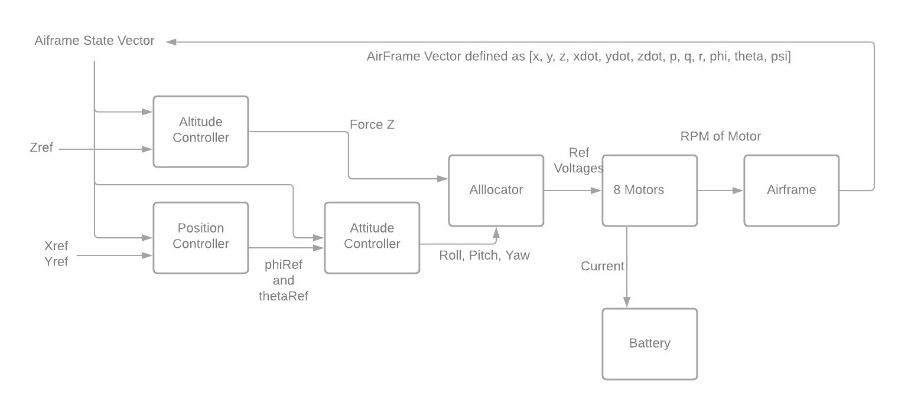

# A python implementation of the Tarot T18 Octocopter 

This is an implemntation of the Tarot T18 completely in python. It uses a scipy integrator for updating the airframe and provides a complete set of PID controllers for simple path control. 

# Usage 
An example setup of running an entire simulation is given in `examples/simul.py`. From here, the output trajectory as well as battery degredation can be visualized using `examples/plotTraj.py`

An example simulation can be run using ``python .\t18simulation.py -f "paths/p1.csv" -i "test"

### Argument tage
- ``--file``, ``-f``: Path to the input file
- ``--geo``, ``-g``: Does the file contain latitude and longitude or is it in x, y (Default is *True*)
- ``--out``, ``-o``: Path to the output folder (Default is *out*)
- ``--id``, ``-i``: Name appended to the output files
- ``--plot``, ``-p``: To generate plots for the output data (Default is *True*)
- ``--sample``, ``-s``: Point sample interval (m) for coordinate generation (Default is *3*)

## Building Trajectories
Trajectories are built in terms of coupled csv files for x, y, and z where the first column represnts the time and the second column the ref position in either x, y, or z. See `example/simul.py` for a simple example on how trajectories are loaded into a python list. It is worht noting in this simulation, we do not consider take off and landing and thus the angular velocity of the motors are started at 365 rad/sec. This can easily be changed in `src/motor/motor.py` line 21. 

## Battery Model
The battery model is courtesy of Nasa prognostics library available 

## Model Diagram
Quick diagram of the model

# Contact
If there are any issues with the library, please leave a comment on Github or feel free to send me an email at luke.bhan@vanderbilt.edu
